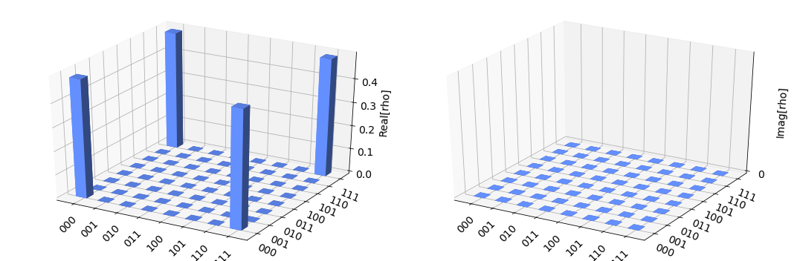
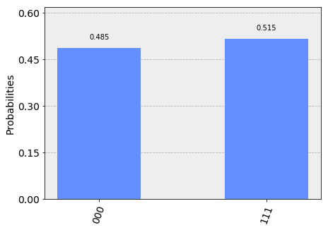
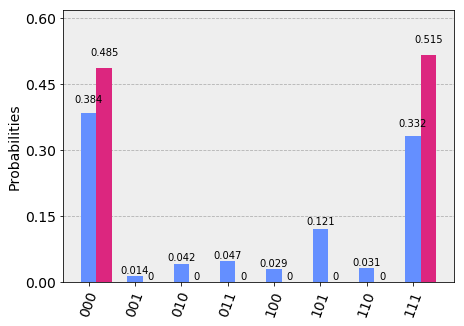
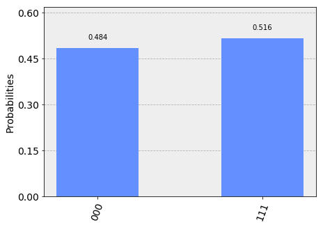

Qiskit 入門
===========================

ここでは Qiskit の使用法について解説します。Qiskit には量子コンピュータ
プログラミングで必要とされる基本的なビルディングブロックが含まれています。
Qiskit の基盤は Terra 要素であり、その基本コンセプトは量子回路の配列です。
Terra を使用したワークフローは「ビルド」と「実行」の2つのステージからなります。
「ビルド」は解決したい問題を表現する異なる量子回路を作成します。
「実行」はこれを異なる「バックエンド」で実行します。ジョブの実行後はデータを収集しますが、
この収集にはプログラムによっていくつかの方法があり、
欲しいデータを取得したり、次のインスタンス用のより良いプログラムを作成できます。

** 目次 **

`回路の基礎 <#circuit_basics>`__

`Qiskit Aer を使用した回路のシミュレーション <#aer_simulation>`__

`IBMQ プロバイダーを使用した回路の実行 <#ibmq_provider>`__

**コードのインポート**

.. code:: ipython3

    import numpy as np
    from qiskit import QuantumCircuit, ClassicalRegister, QuantumRegister
    from qiskit import execute

回路の基礎 
---------------

回路の作成
~~~~~~~~~~~~~~~~~~~~

最初のプラグラムに必要な基本要素は QuantumCircuit と QuantumRegister です。

.. code:: ipython3

    # 3 qubit の量子レジスターを作成
    q = QuantumRegister(3, 'q')
    
    # q レジスターに作用する量子回路の作成
    circ = QuantumCircuit(q)

.. raw:: html

   

注意: QuantumRegister の名前付けはオプションで、必ずしも必要ありません。

.. raw:: html

   

レジスターと回路の作成後は、ゲート(「演算子」) を追加してレジスターを操作します。
この後を読み進めると多くのゲートや回路が登場します。
以下は 3 qubit の GHZ 状態の量子回路の例です。

.. math:: |\psi\rangle = \left(|000\rangle+|111\rangle\right)/\sqrt{2}

この状態を作るには、まず 3 qubit の量子レジスターから始めます。デフォルトでレジスター内の
各 qubit は :math:`|0\rangle` で初期化されます。次に以下のゲートを適用して
GHZ 状態を作成します。
\* qubit 0 に アダマールゲート :math:`H` (作用させると重ね合わせ状態になります)
\* qubit 0 と qubit 1 の間に制御 NOT 演算子 (:math:`C_{X}`) 
\* qubit 0 と qubit 2 の間に制御 NOT 演算子

理想的な量子コンピュータ上でこの量子回路を実行すると、GHZ 状態が作成されます。

Qiskit Terra では以下のように、一つずつ回路に演算子を追加していきます。

.. code:: ipython3

    # qubit 0 に H ゲートを追加。この qubuit は重ね合わせ状態に。
    circ.h(q[0])
    # CX (CNOT) ゲートを追加。制御 qubit は 0、ターゲット qubit は1。Bell 状態に。
    circ.cx(q[0], q[1])
    # CX (CNOT) ゲートを追加。制御 qubit は 0、ターゲット qubit は2。GHZ 状態に。
    circ.cx(q[0], q[2])

.. parsed-literal::

    <qiskit.extensions.standard.cx.CnotGate at 0xa20709128>

回路のビジュアライズ
-------------------------

回路は Qiskit Terra を使ってビジュアライズできます。
``QuantumCircuit.draw()`` は多くの教科書に出てくる形に回路をプロットします。

.. code:: ipython3

    circ.draw()

.. raw:: html

    <pre style="word-wrap: normal;white-space: pre;line-height: 15px;">        ┌───┐          
    q_0: |0>┤ H ├──■────■──
            └───┘┌─┴─┐  │  
    q_1: |0>─────┤ X ├──┼──
                 └───┘┌─┴─┐
    q_2: |0>──────────┤ X ├
                      └───┘</pre>

この回路で qubit は、qubit 0 が先頭、qubit 2 が最後に置かれます。
回路は左から右に読み、先に適用されるゲートは左側に置かれます。

Qiskit Aer を使用した回路のシミュレーション
-----------------------------------------------------------------------

Qiskit Aer は量子回路をシミュレートするパッケージです。シミュレーションを実行する
さまざまな「バックエンド」が提供されています。ここでは基本の python 版を使用します。

Statevector バックエンド
~~~~~~~~~~~~~~~~~~~~~~~~~~~

Qiskit Aer におけるもっとも一般的な「バックエンド」は ``statevector_simulator`` です。
このシミュレータは量子状態を :math:`2^n` 次元の複素ベクトルで返します。
ここで :math:`n` は qubit の数です。急激に大きくなり、値によってはコンピュータで実行できなくなるため
注意して使用してください。

.. raw:: html

   

複数 qubit システムの状態を表す際、qiskit で使用されるテンソル順は多くの物理の教科書と異なります。
:math:`n` qubit において qubit :math:`j` を :math:`Q_{j}` で表すとすると、
:math:`n`-qubit 状態空間の基底ベクトルは
多くの教科書、例えば Nielsen と Chuang の「Quantum Computation and Information」
(『量子コンピュータと量子通信』ミカエル・ニールセン、アイザック・チャン著、木村達也訳、オーム社)で
次のように表されますが、

:math:`Q_{0}\otimes Q_{1} \otimes \cdots \otimes Q_{n}`

**これは qiskit で使用される順番ではありません!** 代わりに qiskit では :math:`n^{\mathrm{th}}` qubit を
テンソル積の *左側* に置きます。上の基底ベクトルは次のようになります。

:math:`Q_n\otimes \cdots \otimes Q_1\otimes Q_0`

たとえば qubit 0 が 0 状態、qubit 1 が 0 状態、qubit 2 が 1 状態 の場合、
qiskit はこの状態を :math:`|100\rangle` として表します。多くの物理の教科書では
これが :math:`|001\rangle` となります。

この表記の違いは複数 qubit 演算を行列で表す際に浮かび上がります。たとえば qiskit は
制御ビットに qubit 0、ターゲットビットに qubit 1 をとる制御 X (:math:`C_{X}`) 演算子を
次のように表します。

.. math:: C_X = \begin{pmatrix} 1 & 0 & 0 & 0 \\  0 & 0 & 0 & 1 \\ 0 & 0 & 1 & 0 \\ 0 & 1 & 0 & 0 \\\end{pmatrix}.

.. raw:: html

   

statevector シミュレータを使用して上の回路を実行するには、まず Aer をインポートし、
次に「バックエンド」を ``statevector_simulator`` に設定します。

.. code:: ipython3

    # Aer のインポート
    from qiskit import BasicAer
    
    # statevector シミュレータバックグラウンド上で量子回路を実行する。
    backend = BasicAer.get_backend('statevector_simulator')

「バックエンド」を選択したので、量子回路をコンパイルし実行できます。
Qiskit Terra では ``execute`` 関数を使用します。
``execute`` は、「バックエンド」に送信されたジョブの情報をカプセル化した ``job`` オブジェクトを返します。

.. raw:: html

   

ヒント: Jupyter では上のパラメータを簡単に取得できます。
関数の上にテキストカーソルを置き Shift + Tab を押してください。

.. raw:: html

   

.. code:: ipython3

    # 実行用の量子プログラムの作成 
    job = execute(circ, backend)

プログラムを実行すると、job オブジェクトが作成されます。job オブジェクトには
2つの有用なメソッド ``job.status()`` と ``job.result()`` とがあります。
それぞれジョブの状態と、result オブジェクトを返します。

.. raw:: html

   

注意: ジョブは非同期に動作しますが、result メソッドが呼ばれると同期に切り替わって終了を待ち、
終了するまで次のタスクに移動しません。

.. raw:: html

   

.. code:: ipython3

    result = job.result()

result オブジェクトにはデータが含まれます。Qiskit Terra には量子回路の状態ベクトルを返す
``result.get_statevector(circ)`` メソッドがあります。

.. code:: ipython3

    outputstate = result.get_statevector(circ, decimals=3)
    print(outputstate)

.. parsed-literal::

    [0.707+0.j 0.   +0.j 0.   +0.j 0.   +0.j 0.   +0.j 0.   +0.j 0.   +0.j
     0.707+0.j]

Qiskit Terra にはまた visualization ツールボックスがあり、この結果を表示できます。

次の例では visualization 関数を使用して状態ベクトルの実数部と虚数部をプロットします。

.. code:: ipython3

    from qiskit.tools.visualization import plot_state_city
    plot_state_city(outputstate)

unitary バックエンド
~~~~~~~~~~~~~~~~~~~~

Qiskit Aer には ``unitary_simulator`` もあり、*回路内の与えられたすべての要素にユニタリ演算*を実行します。
この「バックエンド」は量子回路のゲートを表す :math:`2^n \times 2^n` 行列を計算します。

.. code:: ipython3

    # unitary シミュレータバックエンド上で量子回路を実行
    backend = BasicAer.get_backend('unitary_simulator')
    job = execute(circ, backend)
    result = job.result()
    
    # 結果の表示
    print(result.get_unitary(circ, decimals=3))

.. parsed-literal::

    [[ 0.707+0.j  0.707+0.j  0.   +0.j  0.   +0.j  0.   +0.j  0.   +0.j
       0.   +0.j  0.   +0.j]
     [ 0.   +0.j  0.   +0.j  0.   +0.j  0.   +0.j  0.   +0.j  0.   +0.j
       0.707+0.j -0.707+0.j]
     [ 0.   +0.j  0.   +0.j  0.707+0.j  0.707+0.j  0.   +0.j  0.   +0.j
       0.   +0.j  0.   +0.j]
     [ 0.   +0.j  0.   +0.j  0.   +0.j  0.   +0.j  0.707+0.j -0.707+0.j
       0.   +0.j  0.   +0.j]
     [ 0.   +0.j  0.   +0.j  0.   +0.j  0.   +0.j  0.707+0.j  0.707+0.j
       0.   +0.j  0.   +0.j]
     [ 0.   +0.j  0.   +0.j  0.707+0.j -0.707+0.j  0.   +0.j  0.   +0.j
       0.   +0.j  0.   +0.j]
     [ 0.   +0.j  0.   +0.j  0.   +0.j  0.   +0.j  0.   +0.j  0.   +0.j
       0.707+0.j  0.707+0.j]
     [ 0.707+0.j -0.707+0.j  0.   +0.j  0.   +0.j  0.   +0.j  0.   +0.j
       0.   +0.j  0.   +0.j]]

OpenQASM バックエンド
~~~~~~~~~~~~~~~~~~~~~

上のシミュレータは理想的な回路と回路の行列表現で状態出力の情報を表現し有用ですが、
実際の実験は、各 qubit の *測定* 、
一般には計算基底 :math:`|0\rangle, |1\rangle` の qubit の測定により終了します。
状態の情報を得るには測定が必須ですが、
測定は量子システムを古典ビットに崩壊します。

For example, suppose we make independent measurements on each qubit of
the three-qubit GHZ state

.. math:: |\psi\rangle = |000\rangle +|111\rangle)/\sqrt{2},

and let :math:`xyz` denote the bitstring that results. Recall that,
under the qubit labeling used by Qiskit, :math:`x` would correspond to
the outcome on qubit 2, :math:`y` to the outcome on qubit 1, and
:math:`z` to the outcome on qubit 0. This representation of the
bitstring puts the most significant bit (MSB) on the left, and the least
significant bit (LSB) on the right. This is the standard ordering of
binary bitstrings. We order the qubits in the same way, which is why
Qiskit uses a non-standard tensor product order.

The probability of obtaining outcome :math:`xyz` is given by

.. math:: \mathrm{Pr}(xyz) = |\langle xyz | \psi \rangle |^{2}.

By explicit computation, we see there are only two bitstrings that will
occur: :math:`000` and :math:`111`. If the bitstring :math:`000` is
obtained, the state of the qubits is :math:`|000\rangle`, and if the
bitstring is :math:`111`, the qubits are left in the state
:math:`|111\rangle`. The probability of obtaining 000 or 111 is the
same; namely, 1/2:

.. math::

   \begin{align}
   \mathrm{Pr}(000) &= |\langle 000 | \psi \rangle |^{2} = \frac{1}{2}\\
   \mathrm{Pr}(111) &= |\langle 111 | \psi \rangle |^{2} = \frac{1}{2}.
   \end{align}

To simulate a circuit that includes measurement, we need to add
measurements to the original circuit above, and use a different Aer
backend.

.. code:: ipython3

    # Create a Classical Register with 3 bits.
    c = ClassicalRegister(3, 'c')
    # Create a Quantum Circuit
    meas = QuantumCircuit(q, c)
    meas.barrier(q)
    # map the quantum measurement to the classical bits
    meas.measure(q,c)
    
    # The Qiskit circuit object supports composition using
    # the addition operator.
    qc = circ+meas
    
    #drawing the circuit
    qc.draw()

.. raw:: html

    <pre style="word-wrap: normal;white-space: pre;line-height: 15px;">        ┌───┐           ░       ┌─┐
    q_0: |0>┤ H ├──■────■───░───────┤M├
            └───┘┌─┴─┐  │   ░    ┌─┐└╥┘
    q_1: |0>─────┤ X ├──┼───░────┤M├─╫─
                 └───┘┌─┴─┐ ░ ┌─┐└╥┘ ║ 
    q_2: |0>──────────┤ X ├─░─┤M├─╫──╫─
                      └───┘ ░ └╥┘ ║  ║ 
     c_0: 0 ═══════════════════╬══╬══╩═
                               ║  ║    
     c_1: 0 ═══════════════════╬══╩════
                               ║       
     c_2: 0 ═══════════════════╩═══════
                                       </pre>

This circuit adds a classical register, and three measurements that are
used to map the outcome of qubits to the classical bits.

To simulate this circuit, we use the ``qasm_simulator`` in Qiskit Aer.
Each run of this circuit will yield either the bitstring 000 or 111. To
build up statistics about the distribution of the bitstrings (to, e.g.,
estimate :math:`\mathrm{Pr}(000)`), we need to repeat the circuit many
times. The number of times the circuit is repeated can be specified in
the ``execute`` function, via the ``shots`` keyword.

.. code:: ipython3

    # Use Aer's qasm_simulator
    backend_sim = BasicAer.get_backend('qasm_simulator')
    
    # Execute the circuit on the qasm simulator.
    # We've set the number of repeats of the circuit
    # to be 1024, which is the default.
    job_sim = execute(qc, backend_sim, shots=1024)
    
    # Grab the results from the job.
    result_sim = job_sim.result()

Once you have a result object, you can access the counts via the
function ``get_counts(circuit)``. This gives you the *aggregated* binary
outcomes of the circuit you submitted.

.. code:: ipython3

    counts = result_sim.get_counts(qc)
    print(counts)

.. parsed-literal::

    {'000': 497, '111': 527}

Approximately 50 percent of the time the output bitstring is 000. Qiskit
Terra also provides a function ``plot_histogram`` which allows you to
view the outcomes.

.. code:: ipython3

    from qiskit.tools.visualization import plot_histogram
    plot_histogram(counts)

The estimated outcome probabilities :math:`\mathrm{Pr}(000)` and
:math:`\mathrm{Pr}(111)` are computed by taking the aggregate counts and
dividing by the number of shots (times the circuit was repeated). Try
changing the ``shots`` keyword in the ``execute`` function and see how
the estimated probabilities change.

IBMQ プロバイダーを使用した回路の実行
-----------------------------------------

To faciliate access to real quantum computing hardware, we have provided
a simple API interface. To access IBMQ devices, you’ll need an API
token. For the public IBM Q devices, you can generate an API token
`here <https://quantumexperience.ng.bluemix.net/qx/account/advanced>`__
(create an account if you don’t already have one). For Q Network
devices, login to the q-console, click your hub, group, and project, and
expand “Get Access” to generate your API token and access url.

Our IBMQ provider lets you run your circuit on real devices or on our
HPC simulator. Currently, this provider exists within Qiskit, and can be
imported as shown below. For details on the provider, see `The IBMQ
Provider <the_ibmq_provider.ipynb>`__.

.. code:: ipython3

    from qiskit import IBMQ

After generating your API token, call,
``IBMQ.save_account('MY_TOKEN')``. For Q Network users, you’ll also need
to include your access url: ``IBMQ.save_account('MY_TOKEN', 'URL')``

This will store your IBMQ credentials in a local file. Unless your
registration information has changed, you only need to do this once. You
may now load your accounts by calling,

.. code:: ipython3

    IBMQ.load_accounts()

Once your account has been loaded, you can view the list of backends
available to you.

.. code:: ipython3

    print("Available backends:")
    IBMQ.backends()

.. parsed-literal::

    Available backends:

.. parsed-literal::

    [<IBMQBackend('ibmqx4') from IBMQ()>,
     <IBMQBackend('ibmq_16_melbourne') from IBMQ()>,
     <IBMQBackend('ibmq_qasm_simulator') from IBMQ()>,
     <IBMQBackend('ibmq_20_tokyo') from IBMQ(ibm-q-internal, research, yorktown)>,
     <IBMQBackend('ibmq_qasm_simulator') from IBMQ(ibm-q-internal, research, yorktown)>]

Running circuits on real devices
~~~~~~~~~~~~~~~~~~~~~~~~~~~~~~~~

Today’s quantum information processors are small and noisy, but are
advancing at a fast pace. They provide a great opportunity to explore
what `noisy, intermediate-scale quantum
(NISQ) <https://arxiv.org/abs/1801.00862>`__ computers can do.

The IBMQ provider uses a queue to allocate the devices to users. We now
choose a device with the least busy queue which can support our program
(has at least 3 qubits).

.. code:: ipython3

    from qiskit.providers.ibmq import least_busy
    
    large_enough_devices = IBMQ.backends(filters=lambda x: x.configuration().n_qubits > 4 and
                                                           not x.configuration().simulator)
    backend = least_busy(large_enough_devices)
    print("The best backend is " + backend.name())

.. parsed-literal::

    The best backend is ibmqx4

To run the circuit on the backend, we need to specify the number of
shots and the number of credits we are willing to spend to run the
circuit. Then, we execute the circuit on the backend using the
``execute`` function.

.. code:: ipython3

    from qiskit.tools.monitor import job_monitor
    shots = 1024           # Number of shots to run the program (experiment); maximum is 8192 shots.
    max_credits = 3        # Maximum number of credits to spend on executions. 
    
    job_exp = execute(qc, backend=backend, shots=shots, max_credits=max_credits)
    job_monitor(job_exp)

.. parsed-literal::

    HTML(value="
Job Status: job is being initialized 
")

``job_exp`` has a ``.result()`` method that lets us get the results from
running our circuit.

.. raw:: html

   

Note: When the .result() method is called, the code block will wait
until the job has finished before releasing the cell.

.. raw:: html

   

.. code:: ipython3

    result_exp = job_exp.result()

Like before, the counts from the execution can be obtained using
``get_counts(qc)``

.. code:: ipython3

    counts_exp = result_exp.get_counts(qc)
    plot_histogram([counts_exp,counts])

Simulating circuits using a HPC simulator
~~~~~~~~~~~~~~~~~~~~~~~~~~~~~~~~~~~~~~~~~

The IBMQ provider also comes with a remote optimized simulator called
``ibmq_qasm_simulator``. This remote simulator is capable of simulating
up to 32 qubits. It can be used the same way as the remote real
backends.

.. code:: ipython3

    backend = IBMQ.get_backend('ibmq_qasm_simulator', hub=None)

.. code:: ipython3

    shots = 1024           # Number of shots to run the program (experiment); maximum is 8192 shots.
    max_credits = 3        # Maximum number of credits to spend on executions. 
    
    job_hpc = execute(qc, backend=backend, shots=shots, max_credits=max_credits)

.. code:: ipython3

    result_hpc = job_hpc.result()

.. code:: ipython3

    counts_hpc = result_hpc.get_counts(qc)
    plot_histogram(counts_hpc)

Retrieving a previously ran job
~~~~~~~~~~~~~~~~~~~~~~~~~~~~~~~

If your experiment takes longer to run then you have time to wait
around, or if you simply want to retrieve old jobs back, the IBMQ
backends allow you to do that. First you would need to note your job’s
ID:

.. code:: ipython3

    jobID = job_exp.job_id()
    
    print('JOB ID: {}'.format(jobID))        

.. parsed-literal::

    JOB ID: 5c1a2b4f39c21300575b61b0

Given a job ID, that job object can be later reconstructed from the
backend using retrieve_job:

.. code:: ipython3

    job_get=backend.retrieve_job(jobID)

and then the results can be obtained from the new job object.

.. code:: ipython3

    job_get.result().get_counts(qc)

.. parsed-literal::

    {'000': 393,
     '110': 32,
     '111': 340,
     '010': 43,
     '101': 124,
     '001': 14,
     '011': 48,
     '100': 30}

